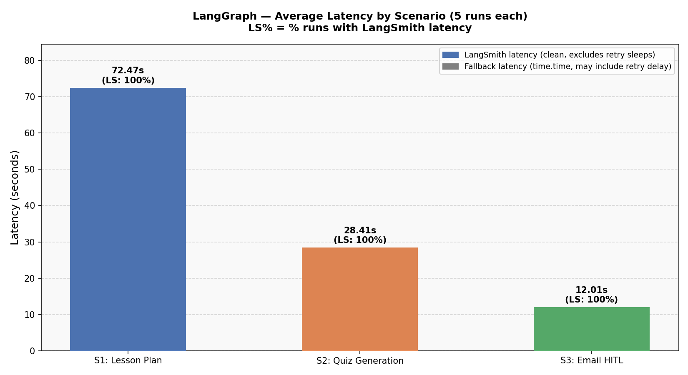
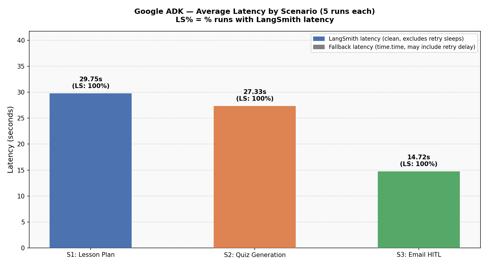
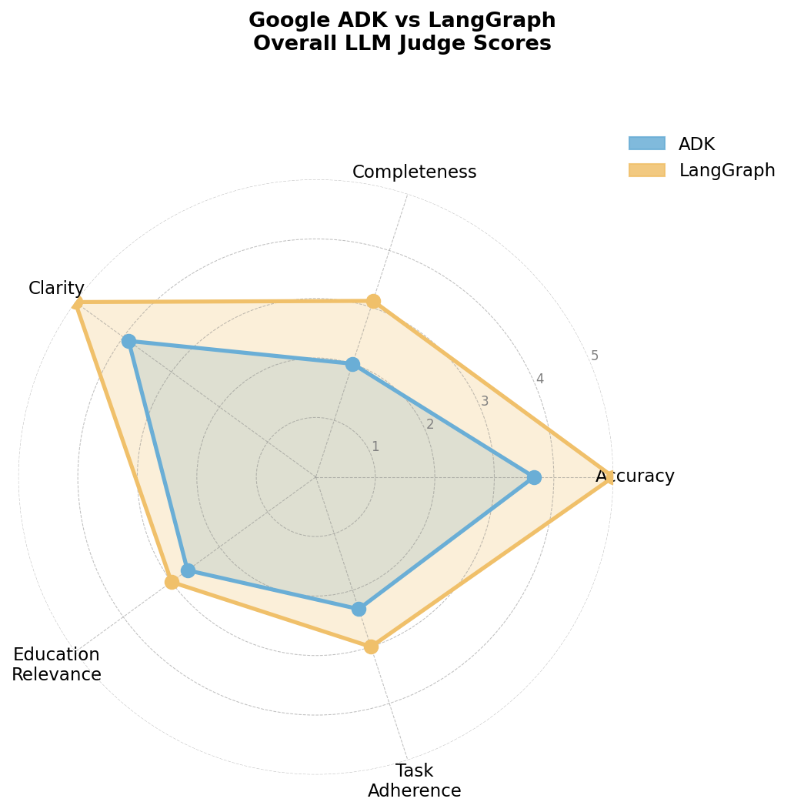
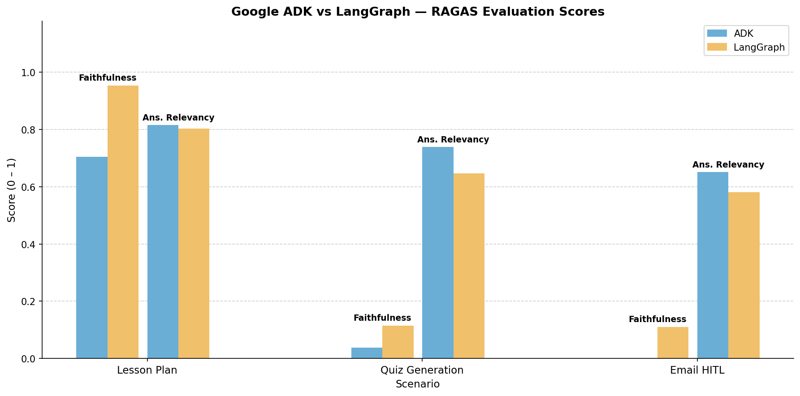
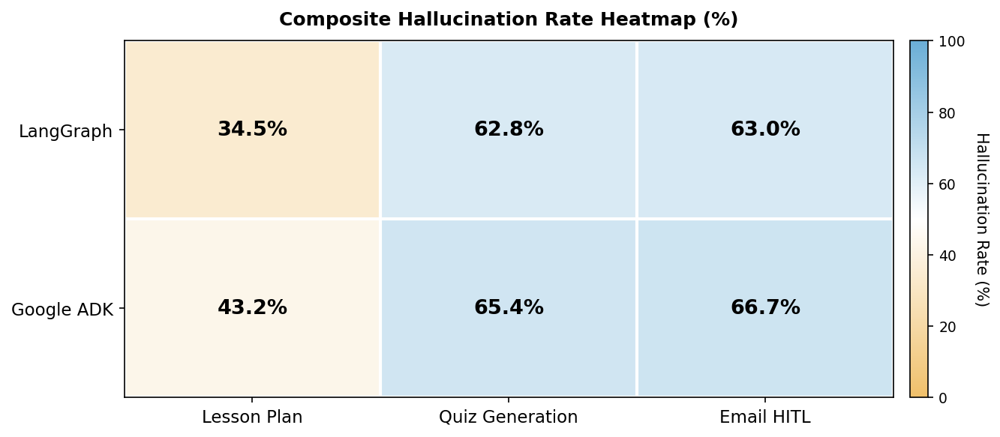

# LangGraph vs Google ADK — AI Teacher Assistant

> **Implementation and evaluation code for:**
> *"A Comparison Framework for LangGraph and Google ADK: Agentic AI Implementation in Educational Context"*
> — Mae Fah Luang University, Thailand (2026)

[](https://colab.research.google.com/github/Timmythaw/langgraph-adk-edu-comparison/blob/main/notebooks/01_langgraph_system.ipynb)
[](https://colab.research.google.com/github/Timmythaw/langgraph-adk-edu-comparison/blob/main/notebooks/02_adk_system.ipynb)
[](LICENSE)

---

## Overview

This repository contains two **parallel, functionally-equivalent** AI Teaching
Assistant implementations — one built with **LangGraph 1.1.2** and one with
**Google ADK 1.27.1** — evaluated against identical test scenarios. Both systems
assist university lecturers at Mae Fah Luang University with three core tasks:

| Task | Description |
|---|---|
| **Lesson Plan Generation** | Grounded 90-minute lesson plans from Vertex AI Search course materials |
| **Quiz Generation** | 10-question MCQ assessments, formatted for instructor review |
| **Student Email with HITL** | Draft → Human-in-the-Loop approval → Send confirmation |

Both use **Gemini 2.5 Pro** as the orchestrator and **Gemini 2.5 Flash** as
worker agents, backed by **Vertex AI Search** for RAG over course materials.
All runs are traced end-to-end via **LangSmith** (project: `langgraph-adk-edu-comparison`).

The evaluation pipeline spans **5 notebooks** covering latency benchmarking,
LLM-as-a-Judge quality scoring, RAGAS RAG faithfulness evaluation, and
hallucination analysis.

---

## Architecture

### LangGraph — Stateful Graph with Explicit Routing
```
└── router (keyword-first, LLM fallback via gemini-2.5-pro)
    ├── lessonplanner ────────────────────────────────────► END
    ├── quizcontent ──► quizpublisher ───────────────────► END
    └── emaildrafter ──► hitlapproval
                         └── emailsender ────────────► END
```

- **Control flow:** Deterministic via `add_conditional_edges`
- **State:** Typed `TeacherState` dict — shared across all nodes (`messages`, `task_type`, `course_materials`, `draft_output`, `final_output`, `hitl_decision`)
- **HITL:** `input()` pause — instructor can **approve (`yes`), reject (`no`), or paste an edited draft**
- **Checkpointing:** `MemorySaver` persists full state across interrupts
- **Token tracking:** Not natively available via `graph.invoke()` — tokens logged as `-1`; available via LangSmith traces

### Google ADK — Agent-as-Tool with AutoFlow
```
RootOrchestrator (LlmAgent, gemini-2.5-pro)
│  ← AutoFlow routing
├── lesson_planner_agent (LlmAgent, gemini-2.5-flash)
│    └── retrieve_course_materials (Vertex AI Search)
├── quiz_generator_agent (SequentialAgent)
│    ├── quiz_content_agent → output_key="quiz_questions_json"
│    └── quiz_publisher_agent → reads {quiz_questions_json}
└── email_agent (SequentialAgent)
     ├── email_drafter_agent → output_key="email_draft"
     └── email_sender_agent → before_tool_callback HITL + send_email_to_students
```

- **Control flow:** Non-deterministic AutoFlow — Gemini reads agent `description` fields
- **State:** Passed via `output_key` between sequential agents; `InMemorySessionService`
- **HITL:** Binary approve/reject only via `before_tool_callback` — no in-place draft editing
- **Resilience:** `HttpRetryOptions` (5 attempts, 5s initial delay, covers 408/429/5xx)
- **Note:** `output_schema` + `tools` cannot be combined in a single ADK `LlmAgent` — Quiz generation requires a 2-agent `SequentialAgent` workaround

---

## Evaluation Pipeline

The full evaluation spans **5 notebooks** run in sequence:

| Notebook | Purpose |
|---|---|
| `01_langgraph_system.ipynb` | LangGraph implementation + 15-run latency experiment |
| `02_adk_system.ipynb` | Google ADK implementation + 15-run latency experiment |
| `03_llm_judge.ipynb` | LLM-as-a-Judge quality scoring (accuracy, completeness, clarity, edu_relevance, task_adherence) |
| `04_ragas_eval.ipynb` | RAGAS RAG evaluation (faithfulness, answer relevancy, context precision, context recall) |
| `05_hallucination.ipynb` | Composite hallucination analysis combining groundedness, RAGAS faithfulness, and judge accuracy |

---

## Results

### Latency Benchmark (Notebooks 01 & 02)

All **30 runs** (5 per scenario × 3 scenarios × 2 frameworks) completed with
**100% routing accuracy**. All latency values are **LangSmith-sourced**.

| Scenario | LangGraph Avg | ADK Avg | Winner |
|---|---|---|---|
| Lesson Plan | 26.17s | 24.82s | ADK |
| Quiz Generation | 25.50s | 26.39s | LangGraph |
| Email HITL | 10.74s | 14.93s | LangGraph |
| **Overall** | **20.80s** | **22.05s** | **LangGraph** |

> Scenario 3 latency includes real human review + typing time for HITL decisions.

### LLM-as-a-Judge Quality Scores (Notebook 03)

Outputs scored by `gemini-2.5-pro` on 5 dimensions (1–5 scale each, max 25 total).
Evaluated on 3 runs per scenario per framework (18 total evaluations).

| Framework | Avg Total | Accuracy | Completeness | Clarity | Edu Relevance | Task Adherence |
|---|---|---|---|---|---|---|
| **LangGraph** | **24.11** | 5.0 | **5.00** | **5.00** | **4.11** | **5.00** |
| Google ADK | 21.67 | 5.0 | 4.44 | 4.67 | 3.67 | 3.89 |

> LangGraph achieves perfect scores in completeness, clarity, and task adherence.
> ADK's lower task_adherence (3.89) was partially driven by one email run (Run 3)
> returning only a send confirmation without the draft content.

### RAGAS RAG Faithfulness (Notebook 04)

| Framework | Faithfulness | Answer Relevancy | Context Precision | Context Recall |
|---|---|---|---|---|
| **LangGraph** | **0.396** | **0.675** | 0.000 | 0.0 |
| Google ADK | 0.278 | 0.663 | 0.222 | 0.0 |

> LangGraph shows higher faithfulness (0.396 vs 0.278), meaning its outputs are
> more grounded in retrieved context. Both frameworks returned 0.0 context recall,
> reflecting the limited size of the test datastore.

### Hallucination Analysis (Notebook 05)

Composite hallucination score combines groundedness, RAGAS faithfulness, and judge accuracy.
Lower composite hallucination % = more grounded output.

| Framework | Scenario | Groundedness | RAGAS Faithfulness | Composite Halluc % |
|---|---|---|---|---|
| LangGraph | Lesson Plan | 1.0 | 0.964 | **34.5%** |
| LangGraph | Quiz | 1.0 | 0.115 | 62.8% |
| LangGraph | Email | 1.0 | 0.110 | 63.0% |
| Google ADK | Lesson Plan | 1.0 | 0.705 | 43.2% |
| Google ADK | Quiz | 1.0 | 0.037 | 65.4% |
| Google ADK | Email | 1.0 | 0.000 | **66.7%** |

> Both frameworks achieve groundedness = 1.0. LangGraph demonstrates lower
> hallucination in lesson plan generation (34.5% vs 43.2%). ADK email runs
> retrieved 0 contexts, contributing to 66.7% composite hallucination.

### Key Findings

| Dimension | LangGraph | Google ADK |
|---|---|---|
| Routing | Deterministic (keyword-first, LLM fallback) | Non-deterministic (AutoFlow) |
| State management | Explicit typed `TeacherState` shared across all nodes | `output_key` chaining between sequential agents |
| Framework constraint | None observed | `output_schema` + `tools` conflict → 2-agent `SequentialAgent` workaround required |
| Token tracking | Not available natively (`-1` sentinel) | Available via `usage_metadata` events |
| Response verbosity | Higher (lesson plans significantly longer) | Lower/more concise |
| Overall avg latency | **20.80s** | 22.05s |
| LLM Judge avg total | **24.11 / 25** | 21.67 / 25 |
| RAGAS faithfulness | **0.396** | 0.278 |
| HITL edit capability | Approve / Reject / **Edit-in-place** | Binary approve/reject only |

### Latency Charts

| LangGraph | Google ADK |
|---|---|
|  |  |

### LLM-as-a-Judge Radar



### RAGAS Comparison



### Hallucination Heatmap



---

## Repository Structure
```
langgraph-adk-edu-comparison/
├── notebooks/
│   ├── 01_langgraph_system.ipynb    # LangGraph implementation + latency experiment
│   ├── 02_adk_system.ipynb          # Google ADK implementation + latency experiment
│   ├── 03_llm_judge.ipynb           # LLM-as-a-Judge quality evaluation
│   ├── 04_ragas_eval.ipynb          # RAGAS RAG faithfulness evaluation
│   └── 05_hallucination.ipynb       # Composite hallucination analysis
├── docs/
│   ├── langgraph_experiment_report.md   # Technical report — LangGraph (NB 01)
│   ├── adk_experiment_report.md         # Technical report — ADK (NB 02)
│   ├── judge_report.md                  # LLM Judge evaluation report (NB 03)
│   └── ragas_report.md                  # RAGAS evaluation report (NB 04)
├── output/
│   ├── langgraph_metrics.csv            # Raw per-run latency data (15 rows)
│   ├── adk_metrics.csv                  # Raw per-run latency data (15 rows)
│   ├── judge_results.csv                # Per-run judge scores
│   ├── hallucination_results.csv        # Per-run hallucination scores
│   ├── hallucination_composite.csv      # Aggregated composite hallucination
│   ├── langgraph_latency_chart.png      # Latency bar chart — LangGraph
│   ├── adk_latency_chart.png            # Latency bar chart — ADK
│   ├── judge_radar_overall.png          # LLM Judge radar chart
│   ├── ragas_comparison_chart.png       # RAGAS comparison chart
│   └── hallucination_heatmap.png        # Hallucination heatmap
├── traces/
│   ├── langgraph_traces.json            # LangSmith traces — all runs
│   └── adk_traces.json                  # LangSmith traces — all runs
├── .env.example
├── .gitignore
├── LICENSE
└── README.md
```

---

## Quick Start

### Prerequisites

- Python 3.10+
- Google Cloud project with **Vertex AI API** and **Discovery Engine API** enabled
- A Vertex AI Search datastore populated with course materials
- LangSmith account for tracing (project: `langgraph-adk-edu-comparison`)

### 1. Clone & Configure

```bash
git clone https://github.com/Timmythaw/langgraph-adk-edu-comparison.git
cd langgraph-adk-edu-comparison
cp .env.example .env
# Edit .env with your GCP credentials
```

### 2. Environment Variables

```bash
# Shared
GOOGLE_CLOUD_PROJECT=your-gcp-project-id
GOOGLE_CLOUD_LOCATION=global
VERTEX_AI_SEARCH_DATASTORE_ID=your-datastore-id
GOOGLE_APPLICATION_CREDENTIALS=./service-account.json

# LangSmith tracing (used by all notebooks)
LANGCHAIN_TRACING_V2=true
LANGCHAIN_API_KEY=your-langsmith-api-key
LANGCHAIN_PROJECT=langgraph-adk-edu-comparison
LANGCHAIN_ENDPOINT=https://api.smith.langchain.com

# ADK only
GOOGLE_GENAI_USE_VERTEXAI=1
LANGSMITH_API_KEY=your-langsmith-api-key
```

### 3. Run in Google Colab (Recommended)

The notebooks are self-contained and designed for Colab. Run them **in order** (01 → 05):

1. Store `GOOGLE_CLOUD_PROJECT`, `GOOGLE_CLOUD_LOCATION`, `VERTEX_AI_SEARCH_DATASTORE_ID`, and `LANGSMITH_API_KEY` as **Colab Secrets**
2. Run all cells in order
3. During Scenario 3 (Email HITL):
   - LangGraph: type `yes` to approve, `no` to reject, or **paste edited text** to approve with changes
   - ADK: type `yes` to approve or anything else to reject
4. Notebooks 03–05 consume the CSV outputs from notebooks 01–02

---

## Documentation

- [LangGraph Experiment Report](docs/langgraph_experiment_report.md) — implementation details, node descriptions, and full latency results
- [ADK Experiment Report](docs/adk_experiment_report.md) — implementation details, agent architecture, and full latency results
- [LLM Judge Report](docs/judge_report.md) — quality scoring methodology and per-run verdicts
- [RAGAS Report](docs/ragas_report.md) — RAG faithfulness evaluation methodology and results

---

## Tech Stack

| Component | LangGraph | Google ADK |
|---|---|---|
| Framework | `langgraph 1.1.2` | `google-adk 1.27.1` |
| Orchestrator LLM | `gemini-2.5-pro` (`ChatGoogleGenerativeAI`, `vertexai=True`) | `gemini-2.5-pro` (`Gemini`, `resilient_pro`) |
| Worker LLM | `gemini-2.5-flash` (`ChatGoogleGenerativeAI`, `vertexai=True`) | `gemini-2.5-flash` (`Gemini`, `resilient_flash`) |
| RAG | Vertex AI Search (Discovery Engine) | Vertex AI Search (Discovery Engine) |
| State | `MemorySaver` + typed `TeacherState` | `InMemorySessionService` + `output_key` chaining |
| Retry logic | None | `HttpRetryOptions` (5 attempts, 429/5xx) |
| Tracing | `LANGCHAIN_TRACING_V2` (native) | `langsmith.integrations.google_adk.configure_google_adk()` |
| Evaluation | LLM-as-a-Judge + RAGAS + Hallucination Analysis | LLM-as-a-Judge + RAGAS + Hallucination Analysis |
| Runtime | Google Colab / Python 3.12 | Google Colab / Python 3.12 |

---

## Citation

If you use this code or findings in your research, please cite:

```bibtex
@misc{thawzinmyoaung_thanthtoosan2026lgadk,
  title  = {A Comparison Framework for LangGraph and Google ADK: Agentic AI Implementation in Educational Context},
  author = {Thaw Zin Myo Aung and Thant Htoo San},
  year   = {2026},
  url    = {https://github.com/Timmythaw/langgraph-adk-edu-comparison}
}
```

---

## License

[MIT License](LICENSE) — Mae Fah Luang University, Thailand, 2026
