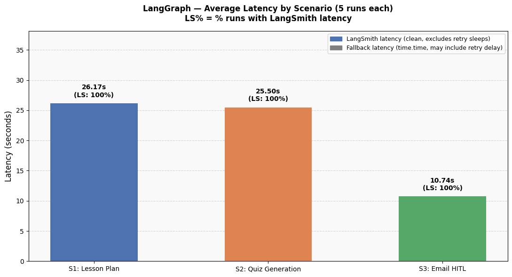
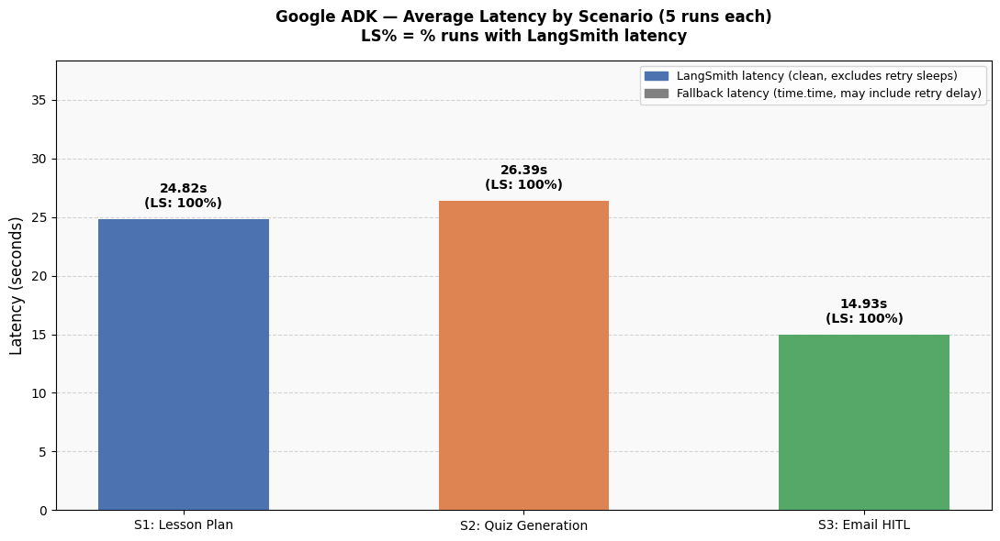

# LangGraph vs Google ADK — AI Teacher Assistant

> **Implementation and evaluation code for:**
> *"A Comparison Framework for LangGraph and Google ADK: Agentic AI Implementation in Educational Context"*
> — Mae Fah Luang University, Thailand (2026)

[](https://colab.research.google.com/github/Timmythaw/langgraph-adk-edu-comparison/blob/main/notebooks/01_langgraph_system.ipynb)
[](https://colab.research.google.com/github/Timmythaw/langgraph-adk-edu-comparison/blob/main/notebooks/02_adk_system.ipynb)
[](LICENSE)

---

## Overview

This repository contains two **parallel, functionally-equivalent** AI Teaching Assistant implementations — one built with **LangGraph 1.1.2** and one with **Google ADK 1.27.1** — evaluated against identical test scenarios. Both systems assist university lecturers at Mae Fah Luang University with three core tasks:

| Task | Description |
|---|---|
| **Lesson Plan Generation** | Grounded 90-minute lesson plans from Vertex AI Search course materials |
| **Quiz Generation** | 10-question MCQ assessments, formatted for instructor review |
| **Student Email with HITL** | Draft → Human-in-the-Loop approval → Send confirmation |

Both use **Gemini 2.5 Pro** as the orchestrator and **Gemini 2.5 Flash** as worker agents, backed by **Vertex AI Search** for RAG over course materials.

---

## Architecture

### LangGraph — Stateful Graph with Explicit Routing

```
START
  └── router_node  (keyword + LLM fallback)
        ├── lesson_planner_node ──────────────────────────► END
        ├── quiz_content_node ──► quiz_publisher_node ────► END
        └── email_drafter_node ──► hitl_approval_node
                                        └── email_sender_node ──► END
```

- **Control flow:** Deterministic via `add_conditional_edges`
- **State:** Typed `TeacherState` dict — shared across all nodes
- **HITL:** `interrupt()` — instructor can **approve, reject, or edit** the draft
- **Checkpointing:** `MemorySaver` persists full state across interrupts

### Google ADK — Agent-as-Tool with AutoFlow

```
RootOrchestrator (LlmAgent, gemini-2.5-pro)
│  ← AutoFlow routing
├── lesson_planner_agent (LlmAgent)
│     └── retrieve_course_materials (Vertex AI Search)
├── quiz_generator_agent (SequentialAgent)
│     ├── quiz_content_agent   → output_key="quiz_questions_json"
│     └── quiz_publisher_agent → reads {quiz_questions_json}
└── email_agent (SequentialAgent)
      ├── email_drafter_agent  → output_key="email_draft"
      └── email_sender_agent   → HITL gate + confirmation
```

- **Control flow:** Non-deterministic AutoFlow — Gemini reads agent `description` fields
- **State:** Passed via `output_key` between sequential agents
- **HITL:** Binary approve/reject only (no in-place editing)
- **Note:** `output_schema` + `tools` cannot be combined in a single ADK agent — Quiz generation requires a 2-agent workaround

---

## Results

All **15 runs** (5 per scenario × 2 frameworks) completed with **100% routing accuracy**.

### Latency by Scenario

| Scenario | LangGraph Avg | ADK Avg | Winner |
|---|---|---|---|
| Lesson Plan | 23.99s | 21.06s | ADK |
| Quiz Generation | 21.61s | 27.99s | LangGraph |
| Email HITL | 9.53s | 15.30s | LangGraph |
| **Overall** | **18.38s** | **21.45s** | **LangGraph** |

> Scenario 3 latency includes real human review + typing time (end-to-end HITL measurement).

### Latency Charts

| LangGraph | Google ADK |
|---|---|
|  |  |

### Side-by-Side Comparison


### Key Findings

| Dimension | LangGraph | Google ADK |
|---|---|---|
| Routing | Deterministic (keyword + LLM fallback) | Non-deterministic (AutoFlow) |
| HITL flexibility | Approve / Reject / **Edit in-place** | Approve / Reject only |
| State management | Explicit typed `TeacherState` | `output_key` chaining |
| Framework constraint | None observed | `output_schema` + `tools` conflict → requires 2-agent workaround |
| Response verbosity | Higher (6,874–9,623 chars for lesson plans) | Lower (3,776–4,652 chars) |
| Overall avg latency | **18.38s** | 21.45s |

---

## Repository Structure

```
langgraph-adk-edu-comparison/
├── notebooks/
│   ├── 01_langgraph_system.ipynb   # LangGraph implementation + experiment
│   └── 02_adk_system.ipynb         # Google ADK implementation + experiment
├── docs/
│   ├── langgraph_experiment_report.md  # Detailed technical report — LangGraph
│   └── adk_experiment_report.md        # Detailed technical report — ADK
├── output/
│   ├── langgraph_metrics.csv       # Raw per-run data (15 rows)
│   ├── adk_metrics.csv             # Raw per-run data (15 rows)
│   ├── langgraph_latency.png       # Latency bar chart — LangGraph
│   ├── adk_latency.png             # Latency bar chart — ADK
│   └── LG VS ADK.png               # Side-by-side comparison chart
├── .env.example                    # Environment variable template
├── .gitignore
├── LICENSE
└── README.md
```

---

## Quick Start

### Prerequisites

- Python 3.10+
- Google Cloud project with **Vertex AI API** and **Discovery Engine API** enabled
- A Vertex AI Search datastore populated with course materials
- (Optional) LangSmith account for LangGraph tracing

### 1. Clone & Configure

```bash
git clone https://github.com/Timmythaw/langgraph-adk-edu-comparison.git
cd langgraph-adk-edu-comparison
cp .env.example .env
# Edit .env with your GCP project ID, datastore ID, and credentials
```

### 2. Environment Variables

```bash
GOOGLE_CLOUD_PROJECT=your-gcp-project-id
GOOGLE_CLOUD_LOCATION=us-central1
VERTEX_AI_SEARCH_DATASTORE_ID=your-datastore-id
GOOGLE_APPLICATION_CREDENTIALS=./service-account.json
LANGCHAIN_TRACING_V2=true               # optional — LangSmith tracing
LANGCHAIN_API_KEY=your-langsmith-api-key
LANGCHAIN_PROJECT=teacher-assistant-langgraph
```

### 3. Run in Google Colab (Recommended)

The notebooks are self-contained and designed for Colab. Click the badges at the top of this README, then:

1. Store `GOOGLE_CLOUD_PROJECT`, `GOOGLE_CLOUD_LOCATION`, and `VERTEX_AI_SEARCH_DATASTORE_ID` as **Colab Secrets**
2. Run all cells in order
3. Respond to HITL prompts when asked (`yes`/`no`) during Scenario 3

---

## Documentation

- [LangGraph Experiment Report](docs/langgraph_experiment_report.md) — implementation details, node descriptions, and full results
- [ADK Experiment Report](docs/adk_experiment_report.md) — implementation details, agent architecture, and full results

---

## Tech Stack

| Component | LangGraph | Google ADK |
|---|---|---|
| Framework | `langgraph 1.1.2` | `google-adk 1.27.1` |
| Orchestrator LLM | `gemini-2.5-pro` | `gemini-2.5-pro` |
| Worker LLM | `gemini-2.5-flash` | `gemini-2.5-flash` |
| RAG | Vertex AI Search (Discovery Engine) | Vertex AI Search (Discovery Engine) |
| State | `MemorySaver` (in-memory) | `InMemorySessionService` |
| Runtime | Google Colab / Python 3.12 | Google Colab / Python 3.12 |

---

## Citation

If you use this code or findings in your research, please cite:

```bibtex
@misc{timmythaw2026lgadk,
  title  = {A Comparison Framework for LangGraph and Google ADK: Agentic AI Implementation in Educational Context},
  author = {Timmythaw},
  year   = {2026},
  url    = {https://github.com/Timmythaw/langgraph-adk-edu-comparison}
}
```

---

## License

[MIT License](LICENSE) — Mae Fah Luang University, Thailand, 2026
